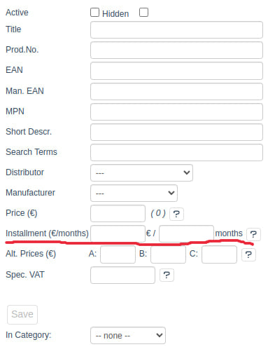
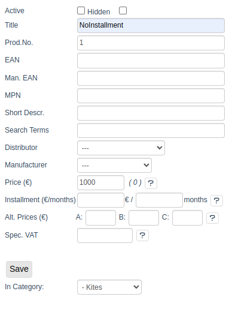
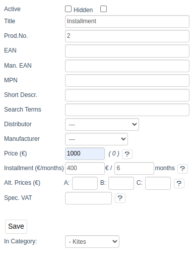
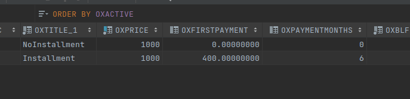
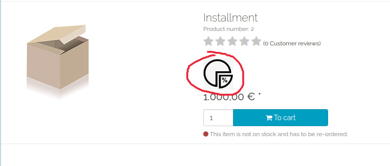
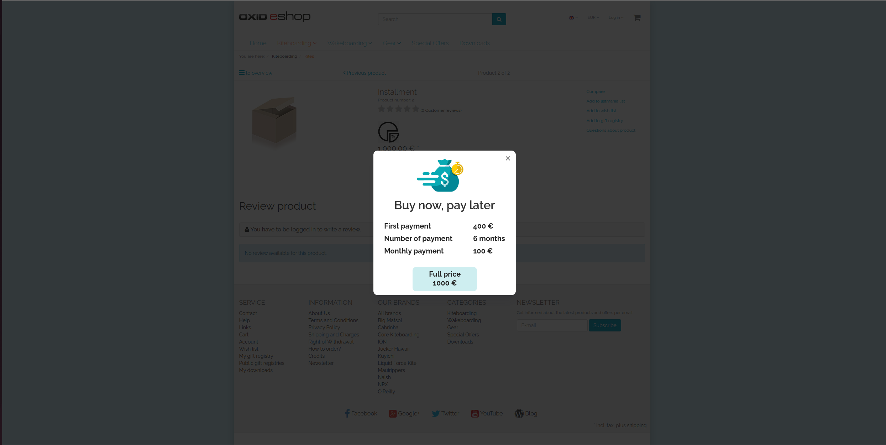
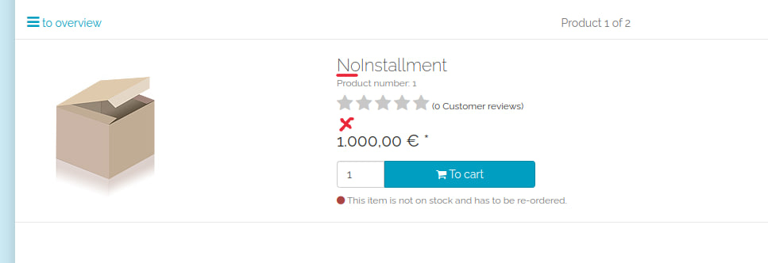

## How to use

Build project

    make build

And run composition

    make up

Now you need enter to app:

    make enter

After you need to do migrations:

    vendor/bin/oe-eshop-db_migrate migrations:migrate

Done:

    URL: localhost:8080

## Result

1. Add to input after price in admin panel  

2. Create 2 articles with and without installments.  
   
   
3. Articles saved in database  
   
4. A banner with information about the installment plan appeared in the article details.
   
5. When you click on the banner, the following information appears. (There is a German translation.)
   
6. The banner will not appear in the Article without an installment plan.
   